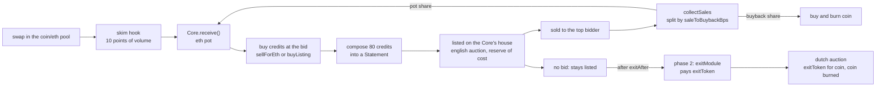

# credits engine

an erc20 on ethereum mainnet whose swap fees buy Credits nfts at a bid, compose them into Statements, and list each statement on an english auction. the engine exists to keep credits flowing into statements: sales do not need to profit, and unsold statements wait for phase 2, when the exitModule redeems them for an exitToken. sale proceeds refill the buying and buy and burn the coin. the coin, pool, hook and fee flow run on the live artcoins stack. every economic number is a setting the owner can change at once. status: unaudited, not deployed. this is branch `flow`.

## contracts

we own three contracts. everything else is live and used as deployed. the artcoins rows are the default config at the pin, the Core takes the artcoins stack as a constructor argument.

| name | role | address |
|---|---|---|
| Core | custody and every rule, the bounty recipient of the skim hook, owner of its auction house | ours, predicted at deploy |
| CoreLib | linked library of the Core: settings write, rate and auction math, the buyback swap | ours, deployed before the Core |
| ControllerV1 | first policy module, immutable | ours, predicted at deploy |
| Core's auction house | where statements are listed, created by the Core in its constructor, owned by it forever | created at deploy |
| pnd auction factory | creates auction houses | 0x77aB853543286C9Cdd7dd6c01222A7cC4Ac93d63 |
| ArtCoinsToken | the coin, launched through the factory | created at launch |
| ArtCoinsFactory | launches the coin and pool | 0x49596c375c139E79bb937bcf826068a8F78D4e0e (default config) |
| skim hook | takes the swap fee in eth and pushes it to the Core | 0x636c050296B5Cc528D8785169Bf8923716FCa9cc |
| lp locker | holds the launch liquidity | 0x866ea3Dc2bf7A3e77374619cf50EB697FA766aab |
| fee escrow | creator and reward payouts | 0x7559689765aE86cBB38e68CD1294830CccB125F2 |
| anti sniper module | linear skim decay for the first 30 minutes | 0xb038D597365FfD108D63C265Bb0621444a1D8B83 |

## flow



credits keep being bought whatever the statements do. the bid is flat per credit at launch (`flatBps` 10_000) and can blend score back in. the full rules, the settings table and the owner powers are in docs/ARCHITECTURE.md.

## branches

| branch | what it holds |
|---|---|
| `flow` | the current implementation. adjustable settings, flat or blended bid, statements sold on the pnd auction house, no inventory gate, no dutch statement auction. the brief is docs/FLOW.md |
| `artcoin` | the earlier implementation on the artcoins launcher with a dutch statement auction and four deploy dials |
| `econ-options` | the economics options as deploy config, with their independent review |
| `main` | the original handoff and its first review fixes |

## build and test

prerequisites: foundry and an archive mainnet rpc (drpc.org, mevblocker.io, blastapi.io or tenderly all work).

```sh
git clone --recurse-submodules <repo>
cd credits-engine
cp .env.example .env
forge build
set -a; . ./.env; set +a
forge test
```

tests run on a mainnet fork pinned to block 26127622 (`FORK_BLOCK`). foundry caches fork state on disk, so the first run is slow. use `--match-path` while iterating, and run one forge command at a time.

* real contracts only, the pnd factory and the Core's house included. the two stand ins are `MockExitModule` and `MockExitToken` in `test/standins/`, attack contracts are in `test/attackers/`
* `test/Flow.t.sol` covers the rework, `test/Launch.t.sol` the launch, `test/Rehearsal.t.sol` forks the latest block and skips unless `REHEARSAL` is set
* check sizes with `forge build --sizes`. every runtime contract must stay under 24,576 bytes
* the simulator needs only node: `node sim/engine.test.mjs` runs its checks, `node sim/build.mjs` rebuilds `sim/index.html`, `node sim/run.mjs q1` runs a batch

## deploy

warning: the owner confirmations in docs/ARCHITECTURE.md section 14 must be settled first.

the system launches on whichever artcoins version is current at deploy time. everything a launch needs is in one config file, `script/config/mainnet.json`: the artcoins stack (with the pnd `auctionFactory`), `rateStart` and the whole `settings` block. copy it to the gitignored `script/config/local.json` and point `LAUNCH_CONFIG` at it. owner, creator, name, symbol and salt are placeholders that must be filled, the deploy refuses to run while any is unset, or unless `CONFIG_HASH` (printed by preflight) matches the file. secrets come from the environment only (`PRIVATE_KEY`, `ETHERSCAN_API_KEY`).

| step | action |
|---|---|
| 1 | fill the config. set `rateStart` on launch day to 75 percent of the market price of a credit (default 1.54e13 for 0.0089 eth), the rule is in docs/DEPLOY.md |
| 2 | rehearse: `REHEARSAL=1 forge test --match-path test/Rehearsal.t.sol -vv` |
| 3 | `forge script script/Preflight.s.sol --rpc-url $MAINNET_RPC_URL` (read only) |
| 4 | the factory owner enables the deployer, `setAdmin(deployer, true)` |
| 5 | `forge script script/Deploy.s.sol --rpc-url $PRIVATE_RPC --broadcast --slow` through a private relay, with `CONFIG_HASH` set. six transactions, the library first. a half finished deploy is finished with `script/Resume.s.sol` |
| 6 | verify CoreLib, ControllerV1 and Core, then `CORE=0x... forge script script/Postflight.s.sol --rpc-url $MAINNET_RPC_URL` (read only) |
| 7 | the factory owner revokes the deployer, `setAdmin(deployer, false)` |

the full runbook is docs/DEPLOY.md.

## docs

| file | what |
|---|---|
| SPEC.md | the original handoff spec |
| docs/FLOW.md | the director brief for this branch and the owner's decisions |
| docs/ARCHITECTURE.md | the system as built on this branch: settings, rules, owner powers, accepted risks |
| docs/SIMULATION.md | what the simulator says, against the owner's goal, with recommended launch settings |
| sim/index.html | the interactive simulator, one file, runs offline |
| docs/DEPLOY.md | the launch runbook, parameter sign off table and the artcoins v2 re check list |
| docs/REVIEW-core.md, REVIEW-econ.md, REVIEW-deploy.md, REVIEW-port.md, REVIEW-hook.md | independent reviews, written before the rework |
| docs/reference/ | artcoins notes, the verified pnd auction house source, tokenworks reference code under MIT |

## license

MIT. listing purchase checks and twap buyback patterns adapted from tokenworks (MIT).
