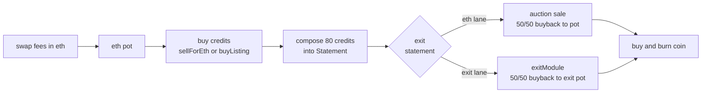

# credits engine

an erc20 on ethereum mainnet whose swap fees buy Credits nfts, compose them into Statements, and exit each statement one of two ways: sold at a falling price auction for eth, or handed to an exit module for an exit token. proceeds buy and burn the coin and refill the buying. status: unaudited, not deployed.

## contracts

| name | role | size |
|---|---|---|
| Coin | erc20, fixed supply, restricted transfers | immutable, no proxies |
| FeeHook | uniswap v4 hook on the coin/eth pool, takes swap fee in eth | immutable, no proxies |
| Core | custody and every rule in this spec | immutable, no proxies |
| ControllerV1 | first policy module | immutable, no proxies |
| Launcher | create2 mining and launch | immutable, no proxies |

## flow



## build and test

prerequisites: foundry, an archive mainnet rpc (drpc.org, mevblocker.io, blastapi.io or tenderly all work).

```sh
git clone --recurse-submodules <repo>
cd credits-engine
cp .env.example .env
forge build
forge test
```

fork tests pin to block 26127622. foundry caches fork state on disk so the first run builds cache (slow) and reruns are fast. test suites: CoreUnit.t.sol, Deploy.t.sol, Seaport.t.sol, Lifecycle.t.sol, CoinHook.t.sol, and invariant tests.

deep invariant campaigns:
```sh
set -a; . ./.env; set +a
INVARIANT_DEEP=1 FOUNDRY_INVARIANT_RUNS=64 FOUNDRY_INVARIANT_DEPTH=200 \
  forge test --match-contract '.*Deep' -vv
```

see test/invariant/Invariants.t.sol header for how to run.

## deploy

**warning: open items in SPEC section 14 must be settled before deploying.**

deploy order and env vars:

| step | contract | env vars |
|---|---|---|
| 1 | Launcher | none |
| 2 | Core | OWNER |
| 3 | Coin | none |
| 4 | ControllerV1 | none |
| 5 | FeeHook | CREATOR |
| 6 | Launcher.launch() | COIN_NAME, COIN_SYMBOL |

read CREATOR, OWNER, COIN_NAME, COIN_SYMBOL, MAINNET_RPC_URL and FORK_BLOCK from the environment. run:

```sh
forge script script/Deploy.s.sol --rpc-url $MAINNET_RPC_URL --broadcast
```

## docs

read SPEC.md for the full spec. docs/ARCHITECTURE.md lists director decisions and deviations to confirm. docs/REVIEW.md contains independent review (may not exist yet; link it anyway). docs/reference/ holds tokenworks reference code and notes under MIT.

## license

MIT. transfer restriction, listing purchase checks and twap buyback patterns adapted from tokenworks (MIT).
