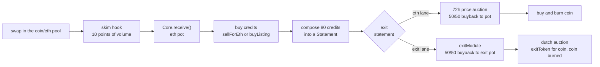

# credits engine

an erc20 on ethereum mainnet whose swap fees buy Credits nfts, compose them into Statements, and exit each statement one of two ways: sold at a falling price auction for eth, or handed to an exit module for an exit token. proceeds buy and burn the coin and refill the buying. the coin, pool, hook and fee flow run on the live artcoins stack. status: unaudited, not deployed.

## contracts

we own two contracts. everything else is live and used as deployed.

| name | role | address |
|---|---|---|
| Core | custody and every rule, and the bounty recipient of the skim hook | ours, predicted at deploy |
| ControllerV1 | first policy module, immutable | ours, predicted at deploy |
| ArtCoinsToken | the coin, launched through the factory | created at launch |
| ArtCoinsFactory | launches the coin and pool | 0x49596c375c139E79bb937bcf826068a8F78D4e0e |
| skim hook | takes the swap fee in eth and pushes it to the Core | 0x636c050296B5Cc528D8785169Bf8923716FCa9cc |
| lp locker | holds the launch liquidity | 0x866ea3Dc2bf7A3e77374619cf50EB697FA766aab |
| fee escrow | creator and reward payouts | 0x7559689765aE86cBB38e68CD1294830CccB125F2 |
| anti sniper module | linear skim decay for the first 30 minutes | 0xb038D597365FfD108D63C265Bb0621444a1D8B83 |

## flow



## build and test

prerequisites: foundry and an archive mainnet rpc (drpc.org, mevblocker.io, blastapi.io or tenderly all work).

```sh
git clone --recurse-submodules <repo>
cd credits-engine
cp .env.example .env
forge build
set -a; . ./.env; set +a
forge test
```

tests run on a mainnet fork pinned to block 26127622 (`FORK_BLOCK`). foundry caches fork state on disk, so the first run is slow. the full suite takes about 3 minutes. use `--match-path` while iterating, and run one forge command at a time.

* real contracts only. the two stand ins are `MockExitModule` and `MockExitToken` in `test/standins/`, attack contracts are in `test/attackers/`
* suites: CoreUnit, Fees, Launch, Lifecycle, ReviewCore, Seaport and the invariant tests in `test/invariant/`
* check sizes with `forge build --sizes`. every runtime contract must stay under 24,576 bytes

deep invariant campaigns:

```sh
set -a; . ./.env; set +a
INVARIANT_DEEP=1 FOUNDRY_INVARIANT_RUNS=64 FOUNDRY_INVARIANT_DEPTH=200 \
  forge test --match-contract '.*Deep' -vv
```

see the header of `test/invariant/Invariants.t.sol` for how to run them.

## deploy

warning: open items in SPEC section 14 and the owner confirmations in docs/ARCHITECTURE.md section 10 must be settled first.

the artcoins factory is deprecated at the pin. before the deploy, the factory owner 0xCB43078C32423F5348Cab5885911C3B5faE217F9 must call `setAdmin(deployer, true)` to enable the deployer. the deployer also pays the factory deploy fee, 0.069 eth at the pin, read live from `deployFee()` at launch.

| step | action |
|---|---|
| 1 | factory owner enables the deployer |
| 2 | predict the Core and ControllerV1 addresses from the deployer nonce, predict the coin address |
| 3 | deploy ControllerV1, then Core |
| 4 | launch the coin through the factory with the launch config |
| 5 | lock the pool extension slot and hand the token admin role to the owner |

launch runbook. the predicted coin address ignores the pool config, so a copy of the launch made first by anyone else would leave the Core bound to a pool that never pays it. the script refuses to start if code already exists at the predicted coin address.

1. keep the artcoins factory deprecated until the launch is mined.
2. the factory owner enables only the deployer address, `setAdmin(deployer, true)`.
3. broadcast through a private relay, never a public mempool.
4. verify the returned coin equals the prediction (the script reverts on a mismatch).
5. the factory owner revokes the deployer, `setAdmin(deployer, false)`.

env vars read by the script: OWNER, CREATOR, COIN_NAME, COIN_SYMBOL, COIN_SALT and MAINNET_RPC_URL.

```sh
forge script script/Deploy.s.sol --rpc-url $MAINNET_RPC_URL --broadcast
```

the launch config table and the deploy order are in docs/ARCHITECTURE.md section 2.

## docs

| file | what |
|---|---|
| SPEC.md | the original handoff spec |
| docs/ARCHITECTURE.md | the system as it is on this branch, and deviations for the owner to confirm |
| docs/REVIEW-core.md | independent review of Core, with a status table for the port |
| docs/REVIEW-hook.md | review of the removed FeeHook, Coin and Launcher, kept for history |
| docs/reference/ | artcoins notes (live addresses, powers, launch recipe) and tokenworks reference code under MIT |

## license

MIT. listing purchase checks and twap buyback patterns adapted from tokenworks (MIT).
