# credits engine

an erc20 on ethereum mainnet whose swap fees buy Credits nfts at a bid, compose them into Statements, and list each statement on an english auction. the engine exists to keep credits flowing into statements: sales do not need to profit, and unsold statements wait for phase 2, when the exitModule redeems them for an exitToken. sale proceeds refill the buying and buy and burn the coin. the coin, pool, hook and fee flow run on the artcoins v2 stack (restricted coin, skim hook, lp locker, fee escrow), with a fee router between the hook and the engine. every economic number is a setting the owner can change at once. status: unaudited, not deployed. this is branch `flow`.

## contracts

we own four contracts. everything else is live, or for the artcoins v2 stack a config input: v2 is not on mainnet yet, so its five addresses in `script/config/mainnet.json` are zero and the deploy refuses the file until they are filled. the Core takes the stack as a constructor argument.

| name | role | address |
|---|---|---|
| Core | custody and every rule, books the router's flushes as fees, owner of its auction house | ours, predicted at deploy |
| CoreLib | linked library of the Core: settings write, rate and auction math, the buyback swap, `rescueNft` | ours, deployed before the Core |
| ControllerV1 | first policy module, immutable | ours, predicted at deploy |
| FeeRouter | bounty recipient of the pool. empty `receive`, permissionless `flush()` (payees, engine), called by the Core at the start of its eth pot doors, owner setters closed by one way `lock` | ours, predicted at deploy |
| Core's auction house | where statements are listed, created by the Core in its constructor, owned by it forever | created at deploy |
| pnd auction factory | creates auction houses | 0x77aB853543286C9Cdd7dd6c01222A7cC4Ac93d63 |
| ArtCoinsTokenV2 | the coin, restricted, launched through the factory | created at launch |
| ArtCoinsFactoryV2, skim hook, lp locker, fee escrow, anti sniper module | the v2 stack, reference commit d4aa46b (branch v2-legibility of the launcher repo) | config input, not on mainnet yet |

## flow

```mermaid
graph LR
    swap["swap in the coin/eth pool"]
    hook["v2 skim hook<br/>6.9 points of volume"]
    router["FeeRouter<br/>6.21 points, flush<br/>payee, engine"]
    pot["Core.receive()<br/>eth pot"]
    buy["buy credits at the bid<br/>sellForEth or buyListing"]
    compose["compose 80 credits<br/>into a Statement"]
    house["listed on the Core's house<br/>english auction, reserve of cost"]
    sold["sold to the top bidder"]
    unsold["no bid: stays listed"]
    collect["collectSales<br/>split by saleToBuybackBps"]
    burn["buy and burn coin"]
    exit["phase 2: exitModule<br/>pays exitToken"]
    dutch["dutch auction<br/>exitToken for coin, coin burned"]

    swap --> hook
    hook --> router
    router --> pot
    pot --> buy
    buy --> compose
    compose --> house
    house --> sold
    house --> unsold
    sold --> collect
    collect -->|pot share| pot
    collect -->|buyback share| burn
    unsold -->|after exitAfter| exit
    exit --> dutch
```



credits keep being bought whatever the statements do. the bid is flat per credit at launch (`flatBps` 10_000) and can blend score back in. the full rules, the settings table and the owner powers are in docs/ARCHITECTURE.md. the owner cannot transfer assets out directly, but it sets the price the engine pays, so a dishonest owner or a stolen owner key could drain the eth pot by selling credits to the engine at an inflated limit, at a bounded pace (docs/ARCHITECTURE.md section 10). holders trust the owner key.

## branches

| branch | what it holds |
|---|---|
| `flow` | the current implementation. adjustable settings, flat or blended bid, statements sold on the pnd auction house, no inventory gate, no dutch statement auction. the brief is docs/FLOW.md |
| `artcoin` | the earlier implementation on the artcoins launcher with a dutch statement auction and four deploy dials |
| `econ-options` | the economics options as deploy config, with their independent review |
| `main` | the original handoff and its first review fixes |

## build and test

prerequisites: foundry and an archive mainnet rpc (drpc.org, mevblocker.io, blastapi.io or tenderly all work).

```sh
git clone --recurse-submodules <repo>
cd credits-engine
cp .env.example .env
forge build
set -a; . ./.env; set +a
forge test
```

tests run on a mainnet fork pinned to block 26127622 (`FORK_BLOCK`). the v2 stack is not on mainnet, so the fixture deploys it onto the fork from prebuilt artifacts of the reference commit (`test/v2-artifacts/README.md`, `test/utils/V2Stack.sol`). foundry caches fork state on disk, so the first run is slow. use `--match-path` while iterating, and run one forge command at a time.

* real contracts only, the pnd factory, the v2 stack artifacts and the Core's house included. the two stand ins are `MockExitModule` and `MockExitToken` in `test/standins/`, attack contracts are in `test/attackers/`
* `test/Flow.t.sol` covers the rework, `test/Launch.t.sol` the launch, `test/V2Port.t.sol`, `V2PortRestriction.t.sol` and `V2PortMigration.t.sol` the v2 fee path, the restricted coin and a second Core, `test/Rehearsal.t.sol` forks the latest block and skips unless `REHEARSAL` is set
* build profiles: only the production contracts (`src/Core.sol`, `src/ControllerV1.sol`, `src/lib/CoreLib.sol`, any new `src/Name.sol`) and the deploy scripts that use `new` (`script/NewProd.sol`, `Deploy.s.sol`, `Resume.s.sol`) compile with via_ir. tests and the other scripts compile without it and reach the production contracts through `src/interfaces/ICore.sol`, `IControllerV1.sol` and `ICoreLib.sol` (generated by `script/tools/gen-interfaces.sh`, rerun it after an abi change, `--check` verifies) and the `Prod` helper in `test/utils/Prod.sol`. never import `src/Core.sol` or `src/ControllerV1.sol` in a test: it pulls the importing file onto via_ir. `test/BuildIdentity.t.sol` proves the fixture deploys the via_ir artifacts. a clean build takes about 4 minutes and 3 gb, a change in a test file about 3 seconds, a change in `src/Core.sol` about 35 seconds
* check sizes with `forge build --sizes`. every runtime contract must stay under 24,576 bytes
* the simulator needs only node: `node sim/engine.test.mjs` runs its checks, `node sim/build.mjs` rebuilds `sim/index.html`, `node sim/run.mjs q1` runs a batch

## deploy

warning: the owner confirmations in docs/ARCHITECTURE.md section 14 must be settled first.

the system launches on the artcoins v2 stack. everything a launch needs is in one config file, `script/config/mainnet.json`: the v2 stack (five addresses, zero until v2 is on mainnet, plus the pnd `auctionFactory`), `rateStart`, the `settings`, `sale`, `launch` and `router` blocks. copy it to the gitignored `script/config/local.json` and point `LAUNCH_CONFIG` at it. the deploy refuses to run while a v2 address is zero, or unless `CONFIG_HASH` (printed by preflight) matches the file. one key, the v2 factory owner, signs everything (`deployTokenAsOwner` is owner only). secrets come from the command line (`--ledger`) or the environment (`ETHERSCAN_API_KEY`).

| step | action |
|---|---|
| 1 | fill the config. set `rateStart` on launch day to the market price of a credit (default 2.0554e13 for 0.0089 eth), the rule is in docs/DEPLOY.md |
| 2 | rehearse: `REHEARSAL=1 forge test --match-path test/Rehearsal.t.sol -vv` |
| 3 | owner command, once: `setMinProtocolSkimShareBps(362)` on the v2 factory (the factory minimum protocol share of the baseline skim, 1,000 on the v2 mainnet environment, must leave room for `bountyBps` 9,638) |
| 4 | `forge script script/Preflight.s.sol --rpc-url $MAINNET_RPC_URL` (read only) |
| 5 | `forge script script/Deploy.s.sol --rpc-url $PRIVATE_RPC --broadcast --slow --ledger` through a private relay, with `CONFIG_HASH` set. nine transactions, the library first, the router setup last. a half finished deploy is finished with `script/Resume.s.sol` |
| 6 | verify CoreLib, ControllerV1, FeeRouter and Core, then `CORE=0x... forge script script/Postflight.s.sol --rpc-url $MAINNET_RPC_URL` (read only) |
| 7 | after launch: the Core pulls the router fees at its doors (a keeper may call `flush()`), owner commands on the router (payees, split start, engine, lock) are in docs/DEPLOY.md section 4 |

the full runbook is docs/DEPLOY.md.

## docs

| file | what |
|---|---|
| SPEC.md | the original handoff spec |
| docs/FLOW.md | the director brief for this branch and the owner's decisions |
| docs/ARCHITECTURE.md | the system as built on this branch: settings, rules, owner powers, accepted risks |
| docs/SIMULATION.md | what the simulator says, against the owner's goal, with recommended launch settings |
| sim/index.html | the interactive simulator, one file, runs offline |
| docs/DEPLOY.md | the launch runbook, parameter sign off table and the artcoins v2 re check list |
| docs/REVIEW-core.md, REVIEW-econ.md, REVIEW-deploy.md, REVIEW-port.md, REVIEW-hook.md | independent reviews, written before the rework |
| docs/reference/ | artcoins notes, the verified pnd auction house source, tokenworks reference code under MIT |

## license

MIT. listing purchase checks and twap buyback patterns adapted from tokenworks (MIT).
