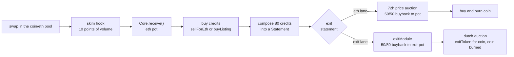

# credits engine

an erc20 on ethereum mainnet whose swap fees buy Credits nfts, compose them into Statements, and exit each statement one of two ways: sold at a falling price auction for eth, or handed to an exit module for an exit token. proceeds buy and burn the coin and refill the buying. the coin, pool, hook and fee flow run on the live artcoins stack. status: unaudited, not deployed.

## contracts

we own two contracts. everything else is live and used as deployed. the artcoins rows are the default config at the pin, the Core takes the artcoins stack as a constructor argument.

| name | role | address |
|---|---|---|
| Core | custody and every rule, and the bounty recipient of the skim hook | ours, predicted at deploy |
| ControllerV1 | first policy module, immutable | ours, predicted at deploy |
| ArtCoinsToken | the coin, launched through the factory | created at launch |
| ArtCoinsFactory | launches the coin and pool | 0x49596c375c139E79bb937bcf826068a8F78D4e0e (default config, a deploy input) |
| skim hook | takes the swap fee in eth and pushes it to the Core | 0x636c050296B5Cc528D8785169Bf8923716FCa9cc |
| lp locker | holds the launch liquidity | 0x866ea3Dc2bf7A3e77374619cf50EB697FA766aab |
| fee escrow | creator and reward payouts | 0x7559689765aE86cBB38e68CD1294830CccB125F2 |
| anti sniper module | linear skim decay for the first 30 minutes | 0xb038D597365FfD108D63C265Bb0621444a1D8B83 |

## flow



## build and test

prerequisites: foundry and an archive mainnet rpc (drpc.org, mevblocker.io, blastapi.io or tenderly all work).

```sh
git clone --recurse-submodules <repo>
cd credits-engine
cp .env.example .env
forge build
set -a; . ./.env; set +a
forge test
```

tests run on a mainnet fork pinned to block 26127622 (`FORK_BLOCK`). foundry caches fork state on disk, so the first run is slow. the full suite takes about 3 minutes. use `--match-path` while iterating, and run one forge command at a time.

* real contracts only. the two stand ins are `MockExitModule` and `MockExitToken` in `test/standins/`, attack contracts are in `test/attackers/`
* suites: CoreUnit, Config, Fees, Launch, Lifecycle, ReviewCore, Seaport and the invariant tests in `test/invariant/`
* `test/Rehearsal.t.sol` forks the latest block and skips unless `REHEARSAL` is set
* check sizes with `forge build --sizes`. every runtime contract must stay under 24,576 bytes

deep invariant campaigns:

```sh
set -a; . ./.env; set +a
INVARIANT_DEEP=1 FOUNDRY_INVARIANT_RUNS=64 FOUNDRY_INVARIANT_DEPTH=200 \
  forge test --match-contract '.*Deep' -vv
```

see the header of `test/invariant/Invariants.t.sol` for how to run them.

## deploy

warning: open items in SPEC section 14 and the owner confirmations in docs/ARCHITECTURE.md section 10 must be settled first.

the system launches on whichever artcoins version is current at deploy time. the artcoins stack (pool manager, hook, tick spacing, pool fee, factory, locker, escrow) and the opening bid `rateStart` are constructor arguments of the Core, so a new artcoins version changes only the stack block of `script/config/mainnet.json`. the live stack at the pin is the default config. four economic dials (`AUCTION_START_X`, `AUCTION_FLOOR_X`, `DROP_BPS`, `INVENTORY_GATE`) are constructor arguments too, under `econ` in the config. the defaults are the engine as specified, `script/config/mainnet.recommended.json` is the same file with the simulation's recommended values, see docs/DEPLOY.md section 2.

everything a launch needs is in a config file: copy `script/config/mainnet.json` to the gitignored `script/config/local.json` and point `LAUNCH_CONFIG` at it. owner, creator, name, symbol and salt are placeholders that must be filled before a launch, the deploy refuses to run while any is unset, or unless `CONFIG_HASH` (printed by preflight) matches the file. secrets come from the environment only (`PRIVATE_KEY`, `ETHERSCAN_API_KEY`). the full runbook is docs/DEPLOY.md.

| step | action |
|---|---|
| 1 | fill the config, set `rateStart` (bounded to 1e11 to 1e15 wei per whole point, default 5.6e12, the launch day rule is in docs/DEPLOY.md) |
| 2 | rehearse: `REHEARSAL=1 forge test --match-path test/Rehearsal.t.sol -vv` forks the latest block and runs preflight, the deploy, postflight and a smoke |
| 3 | `forge script script/Preflight.s.sol --rpc-url $MAINNET_RPC_URL` (read only) |
| 4 | the factory owner enables the deployer, `setAdmin(deployer, true)` |
| 5 | `forge script script/Deploy.s.sol --rpc-url $PRIVATE_RPC --broadcast --slow` through a private relay that serves state reads (`https://rpc.mevblocker.io`), with `CONFIG_HASH` set. a half finished deploy is finished with `script/Resume.s.sol` |
| 6 | verify Core and ControllerV1 on etherscan, then `CORE=0x... forge script script/Postflight.s.sol --rpc-url $MAINNET_RPC_URL` (read only) |
| 7 | the factory owner revokes the deployer, `setAdmin(deployer, false)` |

the full runbook with the exact commands and the verification arguments, the parameter sign off table, the first actions after launch and what to re check when artcoins v2 ships is docs/DEPLOY.md. the launch config table and the deploy order are in docs/ARCHITECTURE.md section 2.

## docs

| file | what |
|---|---|
| SPEC.md | the original handoff spec |
| docs/DEPLOY.md | the launch runbook, parameter sign off table and the artcoins v2 re check list |
| docs/ARCHITECTURE.md | the system as it is on this branch, and deviations for the owner to confirm |
| docs/REVIEW-core.md | independent review of Core, with a status table for the port |
| docs/REVIEW-hook.md | review of the removed FeeHook, Coin and Launcher, kept for history |
| docs/reference/ | artcoins notes (live addresses, powers, launch recipe) and tokenworks reference code under MIT |

## license

MIT. listing purchase checks and twap buyback patterns adapted from tokenworks (MIT).
